## Data visualization: gas prices

### A) Box Plot

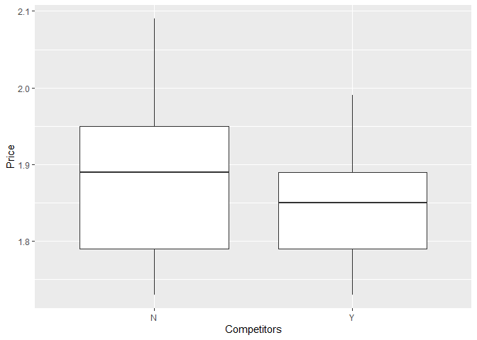

Claim: Gas stations charge more if they lack direct competition in
sight  
Conclusion: Although the price floor is roughly the same, gas stations
without competitors in sight appear to charge substantially higher
prices. This indicates the theory may hold water.

### B) Scatter Plot

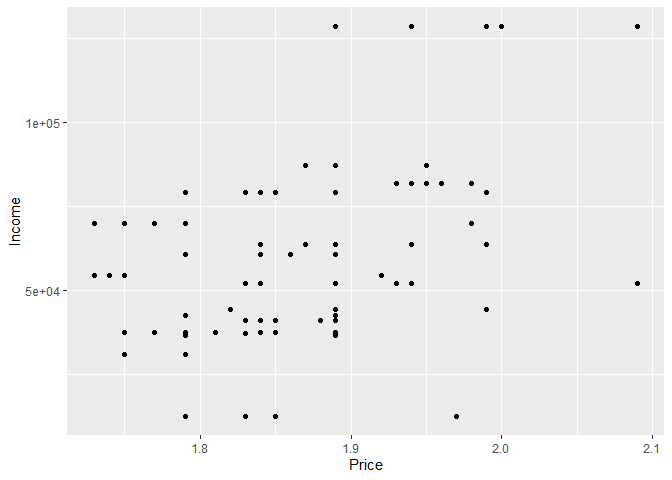

Claim: The richer the area, the higher the gas price  
Conclusion: Prices do appear to trend upwards as income increases

### C) Bar Plot

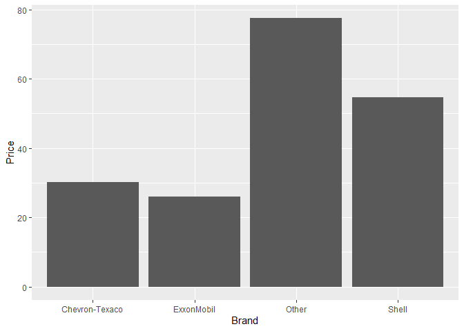

Claim: Shell charges more than other brands  
Conclusion: It appears that Shell charges more than the other major
brands listed in the dataset, but not more than brands that fall into
the “other” category (which might be independent or smaller brands.)

### D) Faceted Histogram

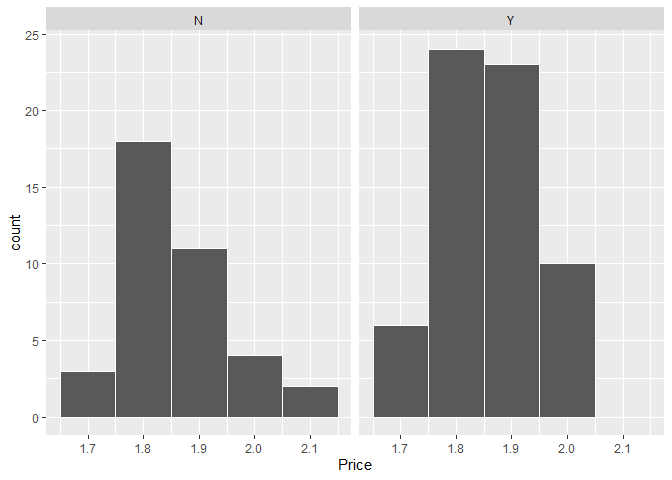

Claim: Gas stations at stoplights charge more  
Conclusion: It does appear that gas stations at stoplights charge more
(and there are more of them overall)

### E) Dealer’s Choice: Boxplot

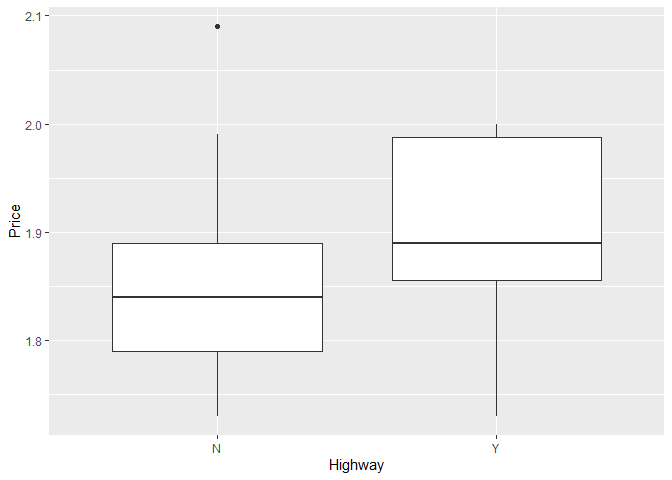

Claim:Gas stations with direct highway access charge more  
Conclusion: Although the sample size is lower for gas stations by the
highway, they do charge more.

## 2) Data visualization: a bike share network

### Plot A: Line Graph

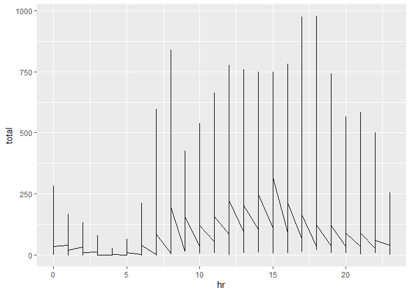

This plot shows total daily ridership (y axis, ‘total’) against the hour
of the day (x axis, ‘hr’). It’s evident that ridership is low from the
hours of midnight through 6AM and then spikes with morning
communtes.There’s a brief lull after the morning commute, followed by
relatively steady afternoon ridership. Rides rise again and peak during
evening rides (potentially return commutes or post-work leisure) before
tapering off again as the night progresses.The lines connecting the
measurement spikes imply that the most granular unit of time measurement
here is an hour.  
One takeaway from this plot is that ridership corresponds to morning and
early evening activity (presumably workers and students commuting) but a
sustained mid-day ridership may also indicate tourists or other reasons
for riding midday that are not well understood.

### Plot B: Faceted Line Graph

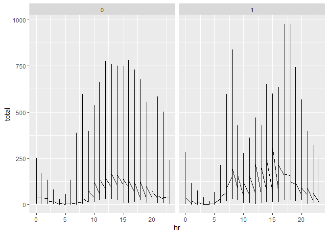

Like the previous plot, this shows total daily ridership (y axis,
‘total’) against the hour of the day (x axis, ‘hr’) with the additional
insight of looking at non-workday ridership (presumably both weekends
and holidays, noted on the lefthand plot “0”) and workdays (represented
by the righthand plot “1”).  
Workday ridership is a much smoother progression from morning till
night, and ridership continues later into the night than during
workdays. For workday ridership, there are spikes in the morning and
early evening likely related to work commutes.

### Plot C: Faceted bar plot

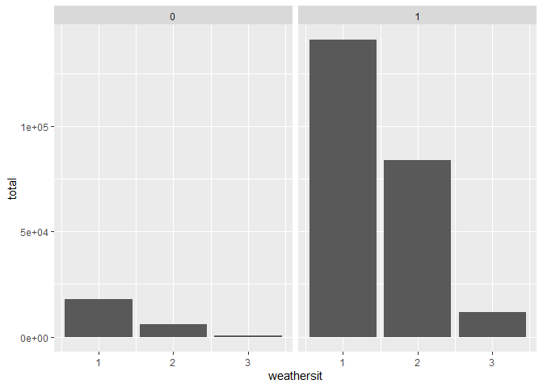

These two bar charts show weekend and holiday ridership (The barchart
‘0’ on the lefthand side) and workday ridership (the barchart ‘1’ on the
righthand side). Total rides are shown on the Y Axis and the severity of
weather event is shown on the X axis, with 1 corresponding to ‘Clear,
Few clouds, Partly cloudy, Partly cloudy;’ 2 corresponding to ‘Mist +
Cloudy, Mist + Broken clouds, Mist + Few clouds, Mist;’ 3 corresponding
to ‘Light Snow, Light Rain + Thunderstorm + Scattered clouds, Light Rain
+ Scattered clouds;’ and 4 to ‘Heavy Rain + Ice Pallets + Thunderstorm +
Mist, Snow + Fog.’  
There are a number of insights that can be inferred from these charts.
Workday ridership is significantly higher in general, and is most
popular when weather conditions are clear. Some riders are willing to
ride on workdays when it’s overcast, but far fewer are likely to ride
when it’s raining or snowing. Amongst non-workday riders, most went out
during clear conditions; some went out during overcast conditions. Few
of the non-workday riders ventured out during snow or rain. Across both
measured groups, no one rode at all during the worst weather conditions
(heavy rain, hail, etc.).

## 3) Data visualization: flights at ABIA

### Which airlines had the most delays in 2008?

    ## Warning: Removed 1601 rows containing missing values (position_stack).

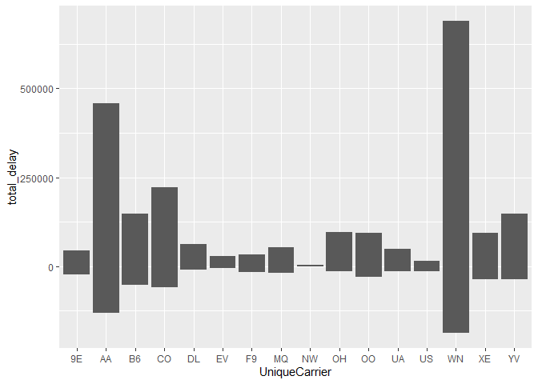

This first bar chart looks at the total amount of time delayed. To
better understand the overall time spent on delays on a given flight, a
new variable total\_delay was created from combining arrival delays and
departure delays. Negative values in the chart indicate the overall
amount of time *saved* from flights arriving ahead of schedule.  
The worst offender is Southwest Airlines (Unique Code is WN) followed by
American Airlines (AA), Continental (CO), Jetblue (B6) and Mesa Airlines
(YV, now defunct). Let’s dig in a bit more to Southwest specifically.
One caveat: the model removed 1601 rows due to incomplete data, so some
airlines may be slightly over or understated in their time delays.

### Is there seasonal variation in Southwest delays?

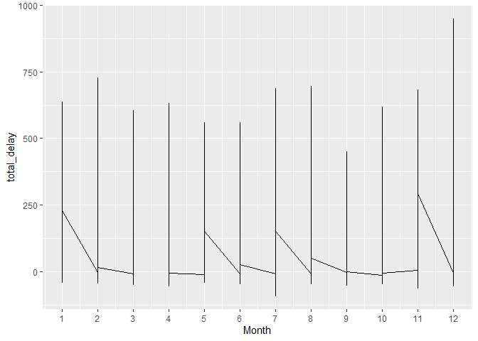

This graph attempts to answer the question of delay seasonality. Months
of the year are displayed on the x-axis (where January = 1) and total
delay time is listed on the y-axis.  
Delays were fairly consistent throughout the year, although there is a
significant uptick in delays in December. Presumably holiday travel
across both Southwest and other airlines is responsible for these
delays. The time of year with the least delays is September, possibly
because it is after summer vacation and lacks many holidays. The time of
year with the highest likelihood to arrive *ahead* of schedule is July.

## 4) K-nearest neighbors

### Investigating the 350 Trim

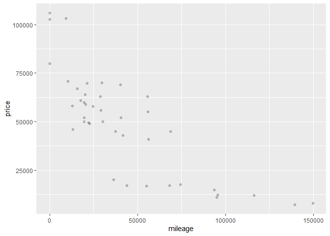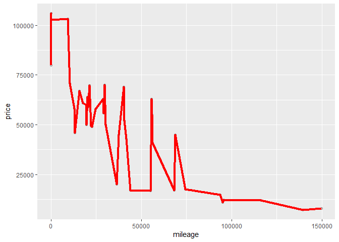

Testing with K=2. rmse is 13895.05 at k=2

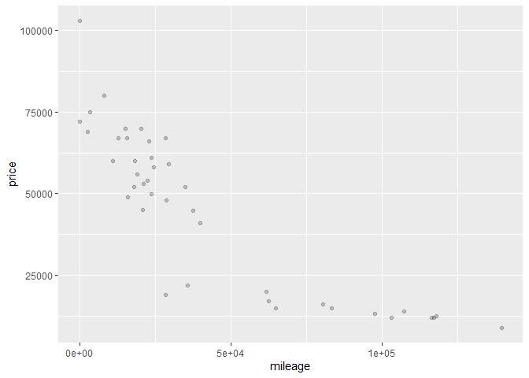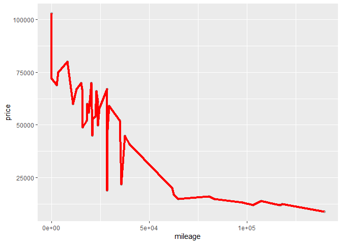

Testing with K=10. rmse is 12793.45 at k=10

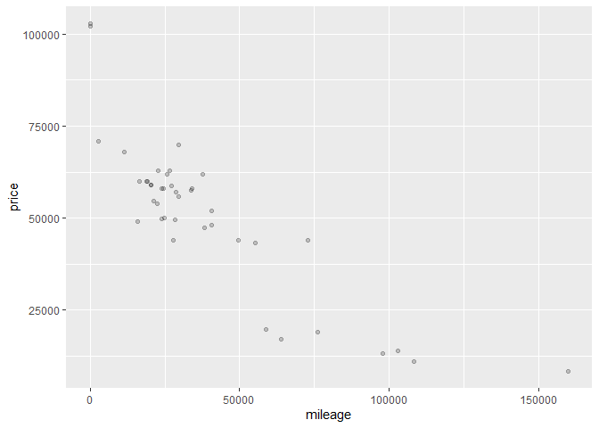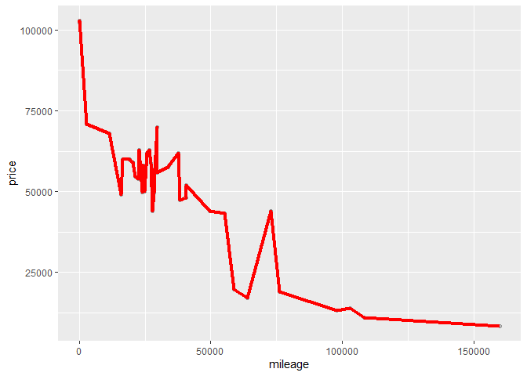

Testing with K=. rmse is 18803.6 at k=20

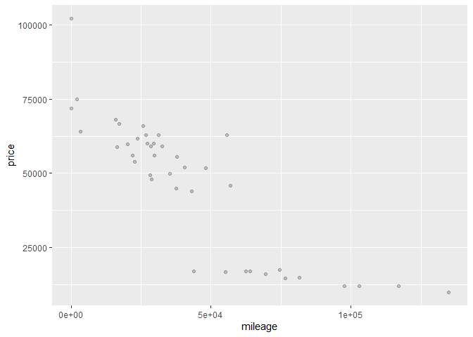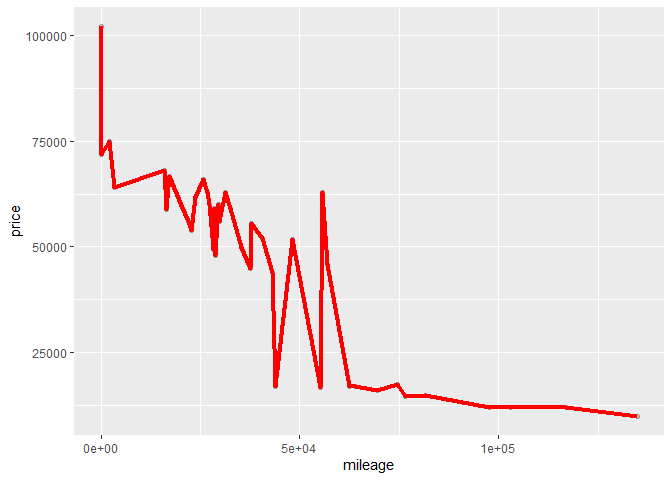

Testing with K=50. rmse is 19491.72 at k=50

### Investigating the 65 AMG Trim

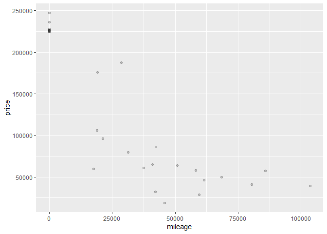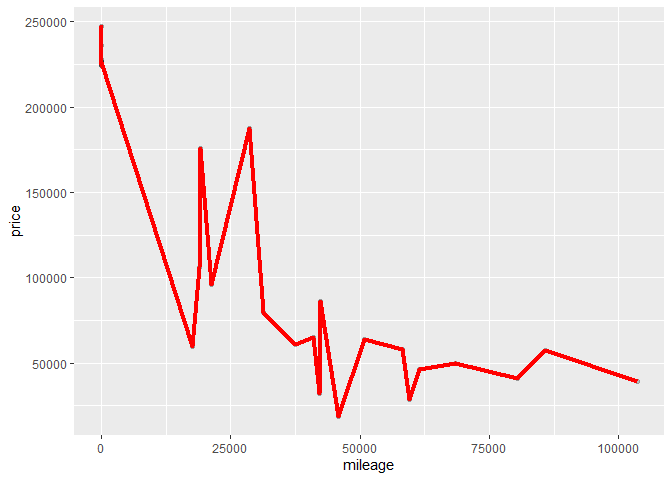

Testing with K=2. rmse is 24235.91 at k=2

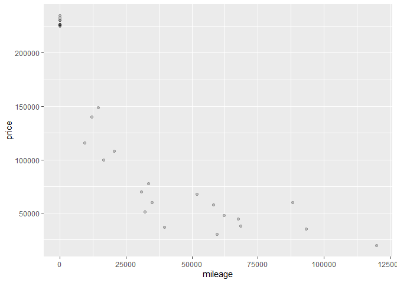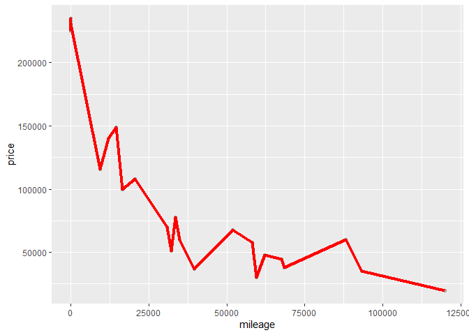

Testing with K=10. rmse is 22966.98 at k=10

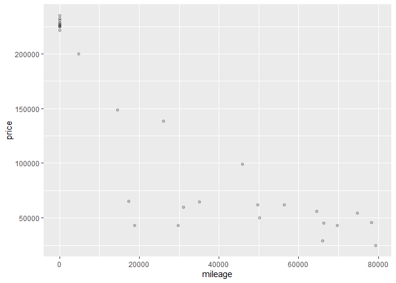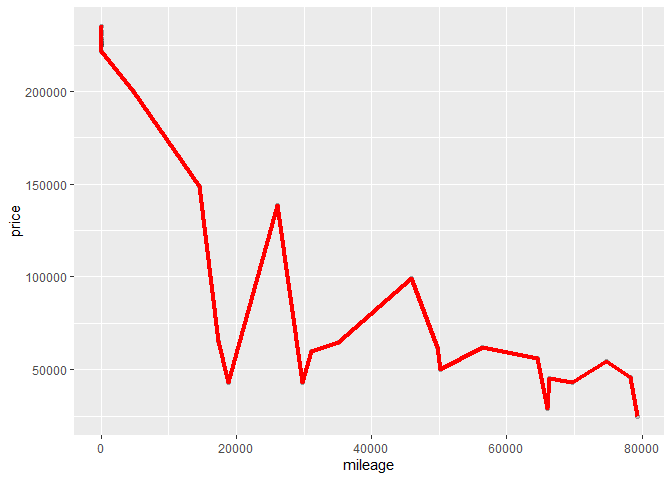

Testing with K=20. rmse is 26695.81 at k=20

    ## [1] 16535.53

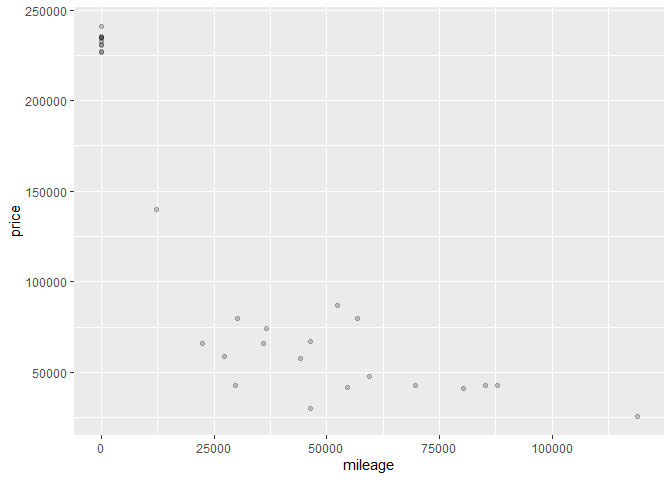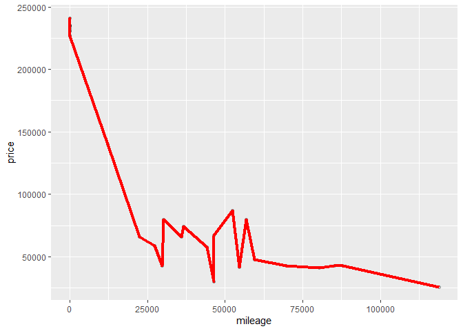

Testing with K=500. rmse is 23020.88 at k=50
