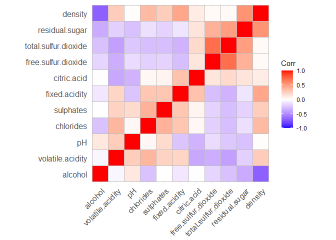
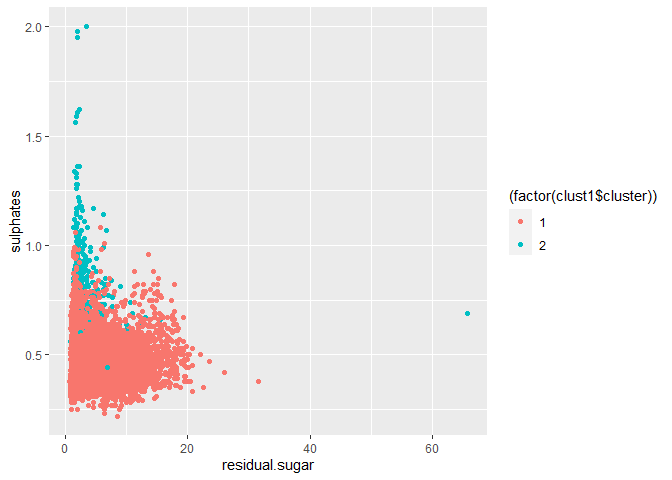
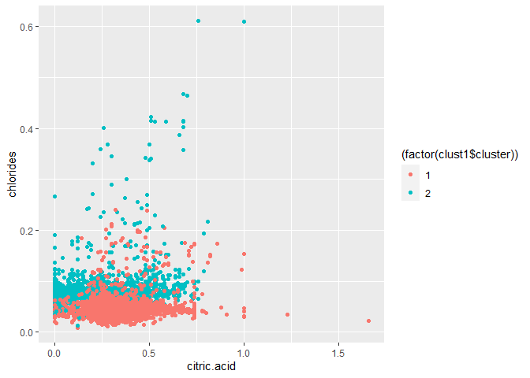

## Wine Analysis with Clustering and PCA

The dataset “wine.csv” contains chemical information from 6500 bottles
of wine along with a subjective quality rating and an indication of
whether the wine is red and white. This analysis attempts to uncover
patterns within the data that reveal the color of the wine and the
quality by solely looking at the chemical composition.

    ## Warning: package 'LICORS' was built under R version 4.0.5

An initial look at the correlation matrix with hierarchical clustering
for the chemical properties shows some clustering around certain
chemical properties.

Running PCA against the data (with K=4) gives us four components that
account for 73.18% of the information contained in the original eleven
features.

    ## Importance of first k=4 (out of 11) components:
    ##                           PC1    PC2    PC3     PC4
    ## Standard deviation     1.7407 1.5792 1.2475 0.98517
    ## Proportion of Variance 0.2754 0.2267 0.1415 0.08823
    ## Cumulative Proportion  0.2754 0.5021 0.6436 0.73187

    ##                        PC1   PC2   PC3   PC4
    ## fixed.acidity        -0.24  0.34 -0.43  0.16
    ## volatile.acidity     -0.38  0.12  0.31  0.21
    ## citric.acid           0.15  0.18 -0.59 -0.26
    ## residual.sugar        0.35  0.33  0.16  0.17
    ## chlorides            -0.29  0.32  0.02 -0.24
    ## free.sulfur.dioxide   0.43  0.07  0.13 -0.36
    ## total.sulfur.dioxide  0.49  0.09  0.11 -0.21
    ## density              -0.04  0.58  0.18  0.07
    ## pH                   -0.22 -0.16  0.46 -0.41
    ## sulphates            -0.29  0.19 -0.07 -0.64
    ## alcohol              -0.11 -0.47 -0.26 -0.11

The loadings for each variable give an indication for what each PCA is
capturing: Pc1 might suggest wines with more sulfur dioxide are less
likely to be acidic Pc2 might suggest that denser wines are also less
alcoholic PC3 seems to be about acidity PC4 seems to be about sulfates

### Approaching the wine data with K Means

The next analysis will approach the dataset with K means. I chose K=2
given that there are two types of wines being evaluated.

Claim: Shell charges more than other brands  
Conclusion: It appears that Shell charges more than the other major
brands listed in the dataset, but not more than brands that fall into
the “other” category (which might be independent or smaller brands.)

Two clusters start to emerge when looking at the chemical properties
residual.sugar and sulphates; one cluster is low in sugar but much
higher in sulfates. Higher sulfates might indicate something about the
wine’s quality.

Applying K means against citric and chlorides paints a murkier picture
given how close the two clusters are here.

## 2) Market Segmentation

Nutrient H20 has a robust and diverse following on Twitter, and this
report attempts to shed light on the broad buckets of personas that make
up the Nutrient H20 fanbase. We ran a PCA analysis against tweets
categorized by 36 predefined interest categories, and picked 10
components that captured 60.77% of the information from the full data.

    ##           X chatter current_events travel photo_sharing uncategorized tv_film
    ## 1 hmjoe4g3k       2              0      2             2             2       1
    ## 2 clk1m5w8s       3              3      2             1             1       1
    ## 3 jcsovtak3       6              3      4             3             1       5
    ## 4 3oeb4hiln       1              5      2             2             0       1
    ## 5 fd75x1vgk       5              2      0             6             1       0
    ## 6 h6nvj91yp       6              4      2             7             0       1
    ##   sports_fandom politics food family home_and_garden music news online_gaming
    ## 1             1        0    4      1               2     0    0             0
    ## 2             4        1    2      2               1     0    0             0
    ## 3             0        2    1      1               1     1    1             0
    ## 4             0        1    0      1               0     0    0             0
    ## 5             0        2    0      1               0     0    0             3
    ## 6             1        0    2      1               1     1    0             0
    ##   shopping health_nutrition college_uni sports_playing cooking eco computers
    ## 1        1               17           0              2       5   1         1
    ## 2        0                0           0              1       0   0         0
    ## 3        2                0           0              0       2   1         0
    ## 4        0                0           1              0       0   0         0
    ## 5        2                0           4              0       1   0         1
    ## 6        5                0           0              0       0   0         1
    ##   business outdoors crafts automotive art religion beauty parenting dating
    ## 1        0        2      1          0   0        1      0         1      1
    ## 2        1        0      2          0   0        0      0         0      1
    ## 3        0        0      2          0   8        0      1         0      1
    ## 4        1        0      3          0   2        0      1         0      0
    ## 5        0        1      0          0   0        0      0         0      0
    ## 6        1        0      0          1   0        0      0         0      0
    ##   school personal_fitness fashion small_business spam adult
    ## 1      0               11       0              0    0     0
    ## 2      4                0       0              0    0     0
    ## 3      0                0       1              0    0     0
    ## 4      0                0       0              0    0     0
    ## 5      0                0       0              1    0     0
    ## 6      0                0       0              0    0     0

    ## Importance of first k=10 (out of 36) components:
    ##                           PC1     PC2     PC3     PC4     PC5     PC6     PC7
    ## Standard deviation     2.1186 1.69824 1.59388 1.53457 1.48027 1.36885 1.28577
    ## Proportion of Variance 0.1247 0.08011 0.07057 0.06541 0.06087 0.05205 0.04592
    ## Cumulative Proportion  0.1247 0.20479 0.27536 0.34077 0.40164 0.45369 0.49961
    ##                            PC8     PC9    PC10
    ## Standard deviation     1.19277 1.15127 1.06930
    ## Proportion of Variance 0.03952 0.03682 0.03176
    ## Cumulative Proportion  0.53913 0.57595 0.60771

Next we investigated these ten cohorts for shared interests (or distinct
lack of interest in certain topics). Although the first and third cohort
(PC1 and PC4) resisted any clearly identifiable label, the rest were
revealing.

    ##                    PC1   PC2   PC3   PC4   PC5   PC6   PC7   PC8   PC9  PC10
    ## chatter          -0.13  0.20 -0.07  0.11 -0.19  0.46 -0.11  0.07 -0.02  0.11
    ## current_events   -0.10  0.06 -0.05  0.03 -0.06  0.14  0.04 -0.05 -0.02 -0.11
    ## travel           -0.12  0.04 -0.42 -0.15 -0.01 -0.16  0.09  0.31  0.02 -0.11
    ## photo_sharing    -0.18  0.30  0.01  0.15 -0.23  0.21 -0.13  0.02  0.02 -0.13
    ## uncategorized    -0.09  0.15  0.03  0.02  0.06 -0.04  0.19 -0.05 -0.05  0.27
    ## tv_film          -0.10  0.08 -0.09  0.09  0.21  0.06  0.50 -0.22  0.13 -0.10
    ## sports_fandom    -0.29 -0.32  0.05  0.06 -0.03  0.01 -0.07 -0.11  0.02 -0.03
    ## politics         -0.13  0.01 -0.49 -0.20 -0.06 -0.13 -0.07  0.01  0.03 -0.04
    ## food             -0.30 -0.24  0.11 -0.07  0.07  0.02  0.04  0.09  0.05 -0.10
    ## family           -0.24 -0.20  0.05  0.07 -0.01  0.05 -0.10 -0.02  0.00 -0.10
    ## home_and_garden  -0.12  0.05 -0.02 -0.01  0.04  0.04  0.09 -0.10 -0.08  0.27
    ## music            -0.12  0.14  0.01  0.08  0.07 -0.01  0.15 -0.09  0.07 -0.18
    ## news             -0.13 -0.04 -0.34 -0.18 -0.03 -0.09 -0.14 -0.46  0.01  0.08
    ## online_gaming    -0.07  0.08 -0.06  0.22  0.48 -0.01 -0.29  0.06 -0.04 -0.01
    ## shopping         -0.13  0.21 -0.05  0.10 -0.20  0.43 -0.09  0.03  0.05 -0.13
    ## health_nutrition -0.12  0.15  0.23 -0.46  0.17  0.08 -0.04  0.04  0.06 -0.03
    ## college_uni      -0.09  0.12 -0.09  0.26  0.49  0.00 -0.19  0.04 -0.01 -0.04
    ## sports_playing   -0.13  0.11 -0.04  0.18  0.37 -0.03 -0.22  0.06  0.01  0.07
    ## cooking          -0.19  0.31  0.19  0.01 -0.12 -0.36 -0.06 -0.05  0.00 -0.11
    ## eco              -0.15  0.09  0.03 -0.12  0.02  0.18  0.00  0.04 -0.08 -0.11
    ## computers        -0.14  0.04 -0.37 -0.14 -0.06 -0.14 -0.01  0.36 -0.01 -0.10
    ## business         -0.14  0.10 -0.11  0.01 -0.05  0.07  0.09  0.14  0.11  0.07
    ## outdoors         -0.14  0.11  0.14 -0.41  0.15  0.04 -0.06 -0.08 -0.03  0.02
    ## crafts           -0.19 -0.02  0.00  0.02  0.04  0.08  0.24  0.03  0.03  0.04
    ## automotive       -0.13 -0.03 -0.19 -0.04 -0.06  0.06 -0.24 -0.59 -0.06  0.08
    ## art              -0.10  0.06 -0.05  0.06  0.16  0.03  0.49 -0.16  0.05 -0.04
    ## religion         -0.30 -0.32  0.09  0.07 -0.02 -0.03  0.02  0.10  0.03 -0.07
    ## beauty           -0.20  0.21  0.15  0.15 -0.19 -0.37 -0.02 -0.06 -0.02 -0.04
    ## parenting        -0.29 -0.30  0.09  0.05 -0.04 -0.01 -0.04  0.06 -0.01 -0.04
    ## dating           -0.11  0.07 -0.03 -0.03 -0.01  0.00  0.03  0.17 -0.05  0.76
    ## school           -0.28 -0.20  0.08  0.09 -0.09  0.01  0.02  0.08 -0.03  0.25
    ## personal_fitness -0.14  0.14  0.22 -0.44  0.16  0.09 -0.04  0.04  0.04 -0.03
    ## fashion          -0.18  0.28  0.14  0.14 -0.17 -0.36 -0.03 -0.02 -0.02  0.04
    ## small_business   -0.12  0.09 -0.10  0.08  0.03  0.05  0.21  0.01 -0.12  0.00
    ## spam             -0.01  0.00 -0.01 -0.02  0.02  0.01  0.07  0.01 -0.66 -0.12
    ## adult            -0.03 -0.01  0.00 -0.02  0.01  0.02  0.07  0.00 -0.69 -0.06

## Recommendations

PC2 consists of people interested in cooking, beauty, shopping, and
fashion (that like to take and share pictures). These may be influencers
or simply modern day epicurians. Messaging for this group should speak
to the elevated sensory experience that NutrientH20 uniquely provides.
PC3 consists of fitness enthusiasts, so the message might highlight the
many nutrients in the beverage. PC5 may capture college age students
interested in online gaming and sports; hydration is necessary for peak
performance in both traditional sports and e-sports, so that message may
be appealing (although likely to come up against other soft drinks and
energy drinks catering to the same group) PC6 picks up a lot of chatter
and shopping content, which may indicate this is a group of bots
promoting affiliate links or simply a group that is difficult to
categorize PC7 consists of artists and creators. Messaging here may
appeal to the value of engaging with all of one’s senses while in a
creative state. PC8 isn’t entirely clear but seems to capture people who
enjoy traveling and computers. You may emphasize NutrientH20’s latest
TCA-compliant travel-size bottles with this savvy crowd.  
PC9 = consists of film enthusiasts, so consider investing in product
placement to reinforce the value to this group. PC10 = captures students
that are interested in dating and maintaining a pleasant home. Consider
an ad campaign that feature couples in a domestic setting.
